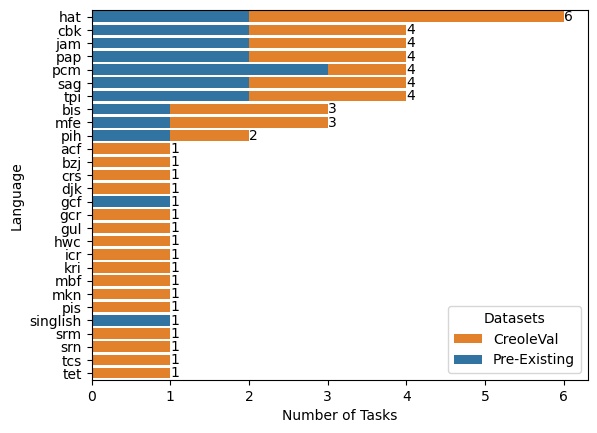
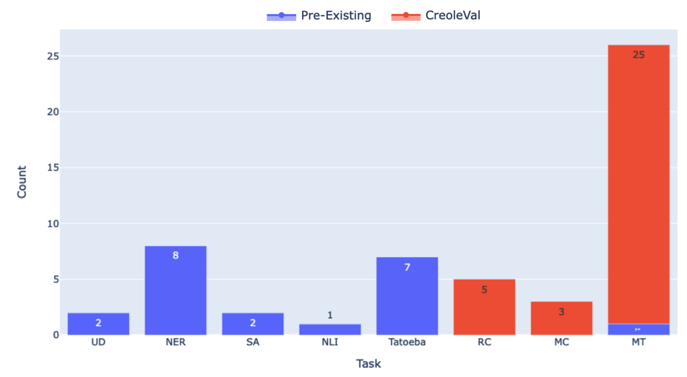

## Overview

This directory contains documentation for additional analysis pertaining to `CreoleVal`, which did not fit in the manuscript

* General `CreoleVal` coverage statistics
* Documentation, data statistics, and analysis for MCTest, Relation Classification, MIT-Haiti Corpus, etc. 
* Statistics and analysis for pre-existing tasks 
* extra charts and graphs

### CreoleVal Specific Statistics

Read here for more statistics on CreoleVal.

**Creole x Number of Tasks, before and after `CreoleVal`:**

**Unique Tasks x ,before and after `CreoleVal`:**

Coverage: `CreoleVal` covers up to 28 Creoles. 
Below, we list the Creoles as their language codes, according to different sources

| Creole                        | Also known as                                                            | ISO 639-3 | Wikipedia code | Other codes (e.g. Glottolog) |
|:------------------------------|:-------------------------------------------------------------------------|:---------:|---------------:|-----------------------------:| 
| Saint Lucian Creole           | Patwa, Kwéyòl, San Miguel Creole, Antillian Creole                       |    acf    |              - |      acf, gcf, scf, sain1246 |
| Bislama                       | Bichelamar                                                               |    bis    |             bi |                     bisl1239 |
| Belize Kriol                  | Belizean Creole, Kriol                                                   |    bzj    |              - |                     beli1260 |  
| Chavacano                     | Chabacano                                                                |    cbk    |        cbk-zam |                     chav1241 |
| Seychellois Creole            | Seselwa, Kreol                                                           |    crs    |              - |                     sese1246 |
| Ndyuka                        | Eastern Maroon Creole, Aukan,  Aukaans, Okanisi, Ndyuka tongo            |    djk    |              - |                     ndyu1242 |
| Guadeloupean Creole           | Kreyol, Kwéyòl, Patois, Antillian Creole                                 |    gcf    |            gcf |      gcf, acf, scf, less1241 |
| Gullah                        | Sea Island Creole, Geechee                                               |    gul    |              - |           gul, afs, gull1241 |
| Haitian Creole                | Kreyòl, Kreyòl Aiyisen                                                   |    hat    |             ht |                     hait1244 |
| Hawaiian Pidgin               | Hawai'i Creole, HCE, Pidgin                                              |    hwc    |              - |                     hawa1247 |
| San Andrés Providencia Creole | -                                                                        |    icr    |              - |                     sana1297 |
| Jamaican Patois               | Patwah, Jamaican Creole                                                  |    jam    |            jam |                     jama1262 |
| Krio                          | Sierra Leonean Creole                                                    |    kri    |              - |                     krio1253 |
| Malay Baba                    | -                                                                        |    mbf    |              - |                     baba1267 |
| Mauritian Creole              | Morisien                                                                 |    mfe    |            mfe |                     mori1278 |
| Kupang Malay                  | -                                                                        |    mkn    |              - |                     kupa1239 |
| Papiamento                    | Papiamentu                                                               |    pap    |            pap |                     papi1253 |
| Nigerian Pidgin               | Pidgin                                                                   |    pcm    |              - |                     nige1257 |
| Pitkern                       | Pitkairn-Norfolk, Pitcairnese                                            |    pih    |            pih |                     pitc1234 |
| Pijin                         | Solomons Pidgin                                                          |    pis    |              - |                     piji1239 |
| Sango                         | Sangho                                                                   |    sag    |             sg |                snj, sang1327 |
| Singlish                      | Colloquial Singaporean English                                           |     -     |              - |                     sing1272 |
| Saramaccan                    | Saamáka                                                                  |    srm    |              - |                     sara1340 |
| Sranan Tongo                  | Sranantongo, Taki Taki, Sranan, Surinaams, Surinamese, Surinamese Creole |    srn    |              - |                     sran1240 |
| Yumplatok                     | Torres Strait Creole                                                     |    tcs    |              - |                     torr1261 |
| Tetun Dili                    | Tetum, Tetun, Tetum Terik, Tetum Prasa                                   |    tet    |              - |                tdt, tetu1245 |
| Tok Pisin                     | New Guinea Pidgin, Pidgin                                                |    tpi    |            tpi |                     tokp1240 |

