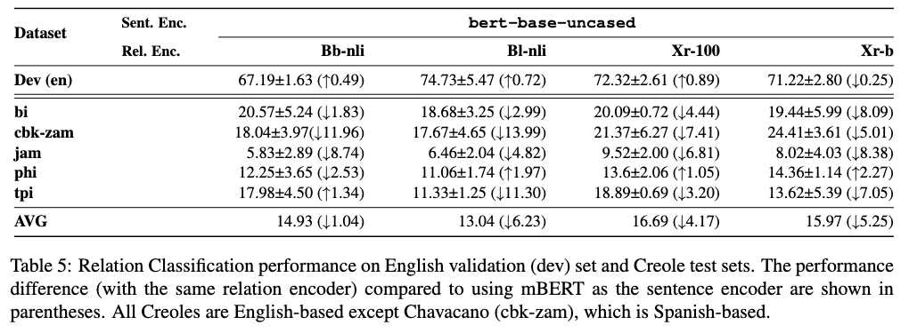

## Relation Classification

Here, we document our methodology for dataset creation, provide statistics on these datasets, and discuss additional details about our training setup, 
and analysis of our results over the Creoles.

#### Dataset creation 

To create our relation classification dataset, we first clean the data and perform automatic entity linking and filtering, in order to facilitate the process of manual annotation. 
First, we preprocess the Wikipedia dumps by removing unnecessary HTML witth [Beaituful Soup](https://www.crummy.com/software/BeautifulSoup/) and tokenization with [Spacy](https://spacy.io).
We then automatically label entities and link them to Wikidata, a process known as entity linking,
first by linking tokens with existing Wikipedia hyperlinks within the text, and then attempt to label any remaining entities without hyperlinks by leveraging [OpenTapioca](https://opentapioca.org/).
Before any manual annotation over these examples, we then attempt to automatically group sentences by *latent templates*, so that sentences can be annotated in groups, allowing us to identify and annotate the correct relationship between the entities, as expressed in the sentences.
To this end, we perform automatic clustering over the sentences using first [fuzzy string matching](https://github.com/seatgeek/thefuzz) with partial token sort ratio, and thereafter [affinity propagation](https://scikit-learn.org/stable/modules/generated/sklearn.cluster.AffinityPropagation.html), in hopes that utterances sharing templatic spans of text will be clustered together.
The result is a large set of clusters, each containing a number of utterances that are at least somewhat similar. 
In order to refine these clusters further, we first rank the clusters by the [longest common string](https://pypi.org/project/suffix-trees/) therein, and we then discard clusters below a certain threshold of similarity, as we can assume the sentences do not belong to the same latent template. 

Finally, with the highest-scoring clusters of entity-linked sentences, the authors perform a manual annotation.
Although the authors performing the annotation are not native speakers of the Creole languages in question, familiarity with the Creoles' ancestor languages (English, French, Spanish) was sufficient to confidently identify entities and the relations expressed in the sentences. 
The manual annotation was conducted in four simple steps: 

1) gathering sentences which indeed belong to the same latent template (i.e., the sentences express the same relation, as evidenced by an exact overlap in the text, with the only differences being the entities), 
2) manually verifying and correcting any mistakes from the automatic entity-linking, 
3) annotating the relation expressed in the set of utterances and its associated Property in Wikidata, and
4) validating that the annotated triples indeed exist in Wikidata; sentences where the triples did not exist in Wikidata (due to gaps in the knowledge base) were thrown out. 

In the end, this resulted in high-quality relation classification evaluation data for 5 of the 9 Creole Wikipedias we started with: Bislama, Chavacano, Jamaican Patois, and Pitkern, and Tok Pisin.  
A major limitation of this method is the reliance on the latent templates within the Creole Wikipedias, meaning that higher quality Wikipedias that didn't rely heavily on templates to generate the Wikipedia, cannot be processed this way.
Still, this annotation process results in the first manually verified relation classification dataset for 5 Creoles.

#### Latent templates

In the paper, we mention the **latent templates** that the sentences belong to, and how these templates enable more confident manual annotation. 
To clarify this, we will show some examples of latent templates, how we map this to Wikidata Properties (i.e. relations) and entities. 

Consider the following entity-tagged sentences in Bislama: 

* [[Mongolia]] i kaontri long [[Esia]].
* [[Fiji]] hem i wan kaontri long [[Pasifik]].
* [[Jemani]] i kaontri long [[Yurop]].
* [[Kanada]] i wan kaontri blong [[Not Amerika]].
* [[Bukina Faso]] i kaontri long [[Afrika]].

When we look at these sentences as a group (i.e. a cluster), we can see there is a latent template of `[[ABC]] i kaontri long [[XYZ]]`. All sentences in the cluster belong to this latent template.

For the **entities** themselves, we can identify the Wikidata Qcode in 2 ways:
1) The entities (e.g. `Mongolia`, `Pasifik`) were alreaady hyperlinked in the Wikipedia article, which means we have a URL, from which we can get the gold entity Q-code.
2) The entities are ostensibly translationese, or are otherwise Named Entities with spelling clearly influenced by English, and we can make an educated guess about the meaning.  

Thus from the template and entities, we can now consider the **relation** between the entities:

(`Mongolia` is to `Asia`) as (`Fiji` is to `Pacific`) as (`Germany` is to `Europe`) as (`Canada` is to `North America`) and (`Burkina Faso` is to `Africa`).   

For all of these entity pairs, to a human annotator, it is clear that the relationship is `[[COUNTRY]] is in [[CONTINENT]]`. 

Thus we can annotate the **Property** as `P30`: "continent of which the subject is a part". 

Finally, we can verify our triples (entity1, Property, entity2) in the Wikidata knowledge graph. 
We remove any sentences where the tripple was NOT in the knowledge graph. 
This unforunately removes correct datapoints, where there is simply a gap in the knoweldge graph. But importantly, it also is a sanity measure of our annotation method, which can require educated guesswork about the meaning of an entity. 
Presumably, if we incorrectly annotated an entity, the tripple will not exist in the knowledge graph, and thus be removed.
Imagine that we had incorrectly annotated `[[Kanada]]` (from the sentence `[[Kanada]] i wan kaontri blong [[Not Amerika]].`) to be the language Kannada (Q33673)), rather than Canada (Q16). 
The triple (Kannada_language, "continent of which the subject is a part", North America) would certainly not exist in Wikidata, and thus the entire annotated example would be removed. 
Yet (Canada, "continent of which the subject is a part", North America) is indeed in the knowledge base, so we can be confident in our annotation. 

Here are some more examples of latent templates in the data, and the relations that the express:

**Chavacano**

Latent template: `[[PERSON]] is a [[SINGER]]`

Examples:

* [[Billie Eilish]] es un [[cantante]]
* [[Sopho Khalvashi]] es un [[cantante]]
* [[Juanes Juanes]] es un [[cantante]] de Colombia de pop.
* [[Nina Sublatti]] (Sulaberidze) es un [[cantante]]
* [[Nini Shermadini]] es un [[cantante]]

Property: `P106`: "occupation of a person"

**Jamaican Patois**

Latent template: `[[CITY]] is the capital of [[COUNTRY]]`

Examples:

* [[Sofiya]] a di kiapital fi [[Bulgieria]].
* [[Broslz]] a di kiapital fi [[Beljiom]].
* [[Ruom]] a di kyapital fi [[Itali]].
* [[Masko]] a di kyapital fi [[Rosha]].
* [[Atenz]] a di kyapital fi [[Griis]].

Property: `P1376`: "capital of" 

#### Dataset statistics

Here is the distribution of the Properties present within our data:

Notably, P1376, P2341, P2936, and P361 have no training samples in the English UKP dataset, and thus are "Unseen".

| Language      | #Properties | #Unseen | #Train  | #Eval Samples | 
|:--------------|:------------|:--------|:-------:|--------------:|
| bi            | 7           | 1       |    -    |            97 | 
| cbk-zam       | 6           | 2       |    -    |            97 | 
| jam           | 12          | 3       |    -    |            97 | 
| phi           | 8           | 3       | -       |            97 | 
| tpi           | 7           | 2       |    -    |            97 |
| en (UKP, m=5) | 108         | -       |  89007  |          4476 | 

#### Performance across Properties

If we examine the relative performance across Properties, we can see that the model predictably performs better on 
Properties, which the model has already seen. Thus the unseen Properties (P1376, P2341, P2936, and P361) have some 
of the lowest F1 scores.

(**NOTE**: These results were taken from just *one* of our trained models.)

#### Baseline Performance on English

| Baseline                                                           | Sentence Encoder | Relation Encoder |  F1   | 
|:-------------------------------------------------------------------|:-----------------|:-----------------|:-----:|
| [Chen and Li, 2021](https://aclanthology.org/2021.naacl-main.272/) | BERT-large       | Bb-nli-large     | 71.96 | 
| Ours                                                               | mBERT            | Bb-nli           | 66.70 | 
| Ours                                                               | XLM-R            | Xr-100           | 52.42 | 

#### English BERT Analysis

To explore whether a *multilingual* language model is more helpful for Creole RC, we conduct a comparative experiment, where we use the English BERT (`bert-base-uncased`), with the same architecture as mBERT.
The table below shows the experimental results. 
Our findings indicate that the English BERT underperforms mBERT, but still generally outperforms XLM-R.
As might be expected, for the Creole language whose parent language is Spanish (cbk-zam), there is a noticeable decline in performance compared to Creole languages whose parent language is English. 
However, this performance decline is somewhat alleviated when using a multilingual relation encoder (Xr-100, Xr-b).

