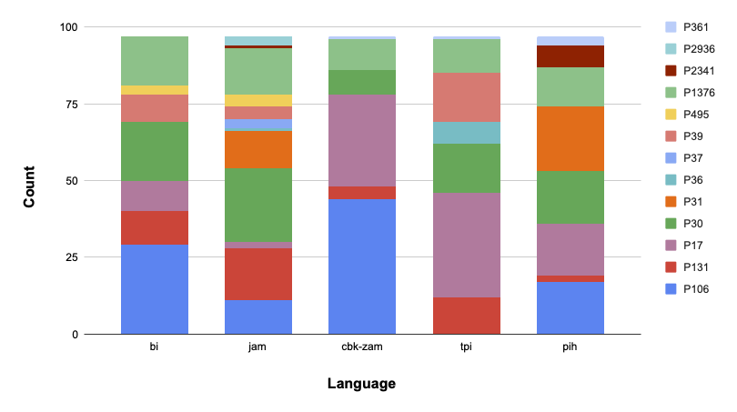
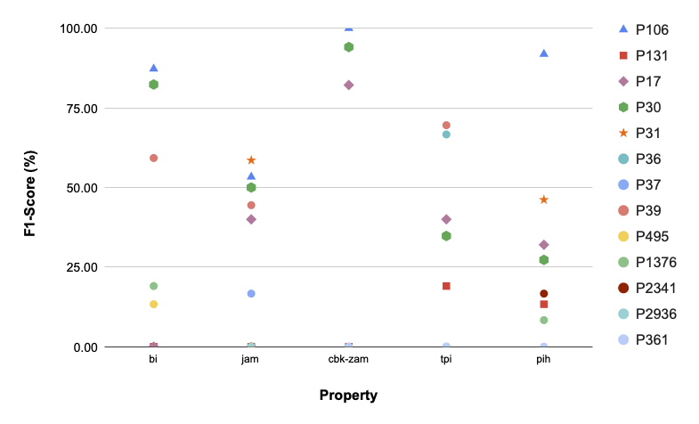

## Relation Classification

Here, we present statistics on our introduced datasets, additional details about our training setup, 
and analysis of our results over the Creoles.

#### Dataset statistics

Here is the distribution of the Properties present within our data:

Notably, P1376, P2341, P2936, and P361 have no training samples in the English UKP dataset, and thus are "Unseen".

| Language | #Properties | #Unseen | #Train  | #Eval Samples | 
|:---------|:------------|:--------|:-------:|--------------:|
| bi       | 7           | 1       |    -    |            97 | 
| cbk-zam  | 6           | 2       |    -    |            97 | 
| jam      | 12          | 3       |    -    |            97 | 
| phi      | 8           | 3       | -       |            97 | 
| tpi      | 7           | 2       |    -    |            97 |
| en (UKP) | 108         | -       |  89007  |          4476 | 

#### Performance across Properties

If we examine the relative performance across Properties, we can see that the model predictably performs better on 
Properties, which the model has already seen. Thus the unseen Properties (P1376, P2341, P2936, and P361) have some 
of the lowest F1 scores.

(**NOTE**: These results were taken from just one of our trained models.)

#### Baseline Performance on English

| Baseline                                                           | Transformer | Sentence Transformer | Recall | Precision | F1 | 
|:-------------------------------------------------------------------|:------------|:---------------------|:-------|:---------:|---:|
| [Chen and Li, 2021](https://aclanthology.org/2021.naacl-main.272/) |             |                      |        |           |    | 
| Ours                                                               | mBERT       | Bb-nli               |        |           |    | 
| Ours                                                               | XLM-R       | Xr-b                 |        |           |    | 

