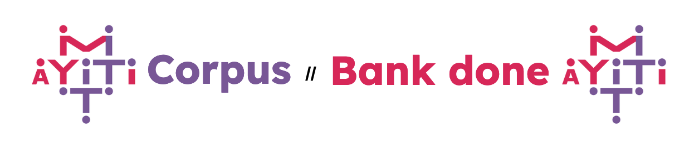

# The MIT-Haiti Corpus

### About

This corpus was made in collaboration with [Platfòm MIT-Ayiti](https://mit-ayiti.net/), who kindly allowed us to utilize their the Haitian Creole educational materials to create the MIT-Haiti Corpus (An kreyòl « *Bank done MIT-Ayiti* »). 
 
In this corpus you will find **parallel** data (ht-en, ht-fr, ht-es), sourced from multilingual childrens stories, to evaluate Machine Translation systems and **monolingual** Haitian data, sourced from lesson plans and blog posts, which can be used for continued pre-training, for example.  

Pou aprann plis, li pòs blog la an kreyòl: [https://mit-ayiti.net/entelijans-atifisyel/](https://mit-ayiti.net/entelijans-atifisyel/).

### OPUS models

Here, we detail how we obtained the results for [OPUS-MT-EN-HT](https://huggingface.co/Helsinki-NLP/opus-mt-en-ht), [OPUS-MT-ES-HT](https://huggingface.co/Helsinki-NLP/opus-mt-es-ht) and [OPUS-MT-FR-HT](https://huggingface.co/Helsinki-NLP/opus-mt-fr-ht) on the MIT-Ayiti test sets.

### Dependencies

The relevant dependencies can be installed using the following command:
`pip install -r requirements.txt` 

### Instructions

Our results can be reproduced by running the following script:

`bash experiments/get_results.sh` 

### Contents

`./data/` contains the MIT-Ayiti corpus.

`./experiments/` contains the script to generate translations (`translate.py`) and the script to evaluate these translations (`eval.py`).

`./experiments/outputs/` contains the translation hypotheses, as generated by `translate.py`, for manual inspection.
